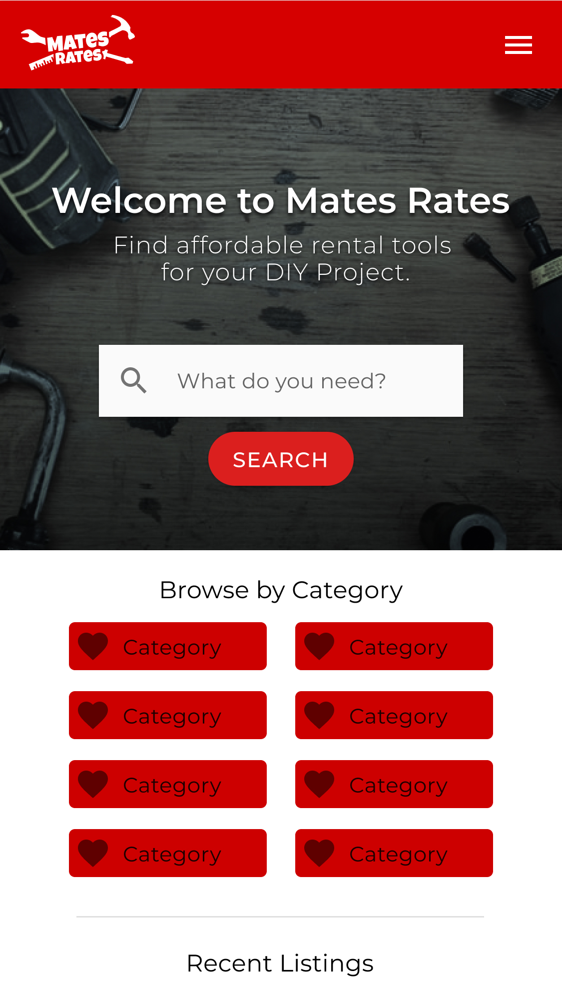
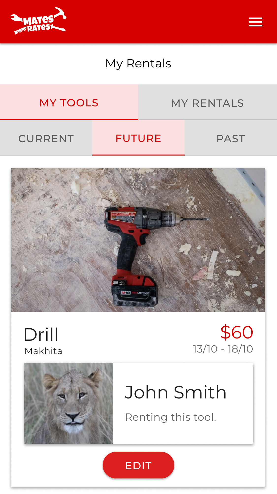

# Mates Rates
## T2A2 Coder Academy - Marketplace Project 
---

Link to Application published on Heroku 

[Link to Github Repo](https://github.com/BenUlcoq/mates_rates)

	

		<b>Table of Contents</b>
	

	
- [Application Purpose](#application-purpose)
- [Application Description](#application-description)
  * [Functionality and Features](#functionality-and-features)
    + [MVP Features](#mvp-features)
    + [Extensibility](#extensibility)
      - [Insurance and Legal Research](#insurance-and-legal-research)
      - [Extensible Features](#extensible-features)
  * [Tech Stack](#tech-stack)
    + [Ruby on Rails](#ruby-on-rails)
    + [PostgreSQL](#postgresql)
    + [Ruby Gems](#ruby-gems)
    + [Third Party Services](#third-party-services)
- [Database Structure](#database-structure)
  * [Database Relations](#database-relations)
    + [User Model](#user-model)
    + [Tool Model](#tool-model)
    + [Rental Model](#rental-model)
    + [Role Model](#role-model)
    + [RolesUsers Join Table](#rolesusers-join-table)
    + [Category Model](#category-model)
    + [CategoriesTools Join Table](#categoriestools-join-table)
  * [Rails Active Record Associations](#rails-active-record-associations)
    + [Mates Rates Associations](#mates-rates-associations)
      - [User Model](#user-model-1)
      - [Tool Model](#tool-model-1)
      - [Rental Model](#rental-model-1)
      - [Category Model](#category-model-1)
      - [Role Model](#role-model-1)
  * [Project Plan and Task Allocation](#project-plan-and-task-allocation)
    + [Brainstorming and Overall Plan](#brainstorming-and-overall-plan)
    + [Sprints](#sprints)
    + [User Stories](#user-stories)
    + [Github Projects](#github-projects)
      - [Screenshots](#screenshots)
    + [Project Timeline](#project-timeline)
      - [Sprints Design](#sprints-design)

# Application Purpose
This application has been developed as part of the requirements of T2A2 at Coder Academy in Brisbane. The assignment involved the development of a two-sided marketplace platform as a way of demonstrating ability to design and develop an application from the ground up, through to deployment. Part of the requirements for this assignment involved solving some kind of problem that exists in the world today.

Between 1961 and 1994, the number of houses in Australia more than doubled from 2.8 million to 6.7 million. [(The Evolution of Australian Home Building)](https://www.architectureanddesign.com.au/features/comment/the-evolution-of-australian-home-building) Due to modern updates and discoveries in building materials and regulations, it is forecast that the amount of renovations needed to be completed on houses built in this time will be rapidly increasing in coming years.  [(Australian Renovation Cost Guide)](https://www.canstar.com.au/home-loans/australian-renovation-cost-guide-not-drill/)

In Australia in 2016, nearly 8.4 million people (62%) of Australians conducted some kind of DIY home renovation. [(Renovation Nation: Home Improvement in Australia)](http://www.roymorgan.com/findings/7102-renovation-nation-home-improvement-in-australia-201701090848) It is a well documented fact that Australians love a Saturday morning trip to Bunnings, with the company reporting revenues in excess of $13.1 billion in  2019.  As such, it can be reasonably concluded that there is substantial demand in the Australian market for access to tools and hardware in order to complete DIY projects and renovations. 

Outside of professional tradespeople, many DIYers wouldn’t need access to this hardware beyond the timeframe of their projects. Yet, of the 8.4 million people who undertook DIY projects, more than 2.2 million (26%) spent more than $5000 on these renovations.  [(Renovation Nation: Home Improvement in Australia)](http://www.roymorgan.com/findings/7102-renovation-nation-home-improvement-in-australia-201701090848)

By having access to the tools and hardware required at a cheap rate, for the duration of a project, Australian DIYers can get more ‘bang for their buck’ when it comes to undertaking renovations.
[Wesfarmers - Bunnings](https://www.wesfarmers.com.au/our-businesses/bunnings)
Although businesses such as Kennards Hire exist to fill this gap, the profit-driven nature of the business means costs of these services can sometimes be high enough that it’s more beneficial for someone to purchase the tool. In instances where people do purchase tools themselves, it is extremely likely that they won’t be using them most of the time, regardless of whether hiring costs made an impact on that decision.

*Mates Rates* solves all of these problems at once by providing a platform for tool owners to rent out their hardware to those looking at completing DIY projects. Tool owners can earn money from hardware that ordinarily would be collecting dust, while DIYers will be able to use tools at a significantly cheaper rate than the options that exist in the market already.

[Leveld](https://getleveld.com/) is an application that already exists with similar functionality, but appears to have a relatively low user count. Widespread adoption is critical to the success of this product and I believe that Leveld has failed to achieve this (so far) due to the fact that the product hasn’t been marketed correctly.

By focusing exclusively on an Australian audience, where DIY is ingrained into the culture, Mates Rates should be able to capitalise on the market and provide an extremely valuable service to Australian DIYers.

---

# Application Description
*Mates Rates* is an application that serves as a platform for users to rent out tools to other users for use in DIY projects. The application provides significant value to both tool owners and tool renters. Tool owners can earn money from their tools which would ordinarily not be receiving much use. Tool renters gain access to the hardware for their job without having to pay extreme prices. 

## Functionality and Features
The application has a number of high-level components that compliment one another to deliver a smooth user experience which allows the users to get the maximum value from the application.

### MVP Features

	

		<b>User Sign-In and Sign-Up</b>
	

The application allows users to create an account using their email address as a unique identifier. Users are authenticated and authorised for accessing certain information as outlined below.

	

		<b>Authentication</b>
	

Although Users who aren’t signed in can browse and view product listings, the ability to rent tools is restricted to those with an account in order to track user interactions with the application and have information relating to a user should issues arise.

	

		<b>Authorisation</b>
	

Within the application, users can have different roles with appropriate permissions. A Renter is the base role assigned to all accounts. In addition to non-user permissions, they have the ability to rent tools from owners. On top of this, Owners have the ability to list tools that they own as available for rent.  Admins have the ability to manipulate all listings on the site, even if they don’t own the tool.

	

		<b>Tool CRUD</b>
	

The ability to create, read, update and destroy tools is part of the core functionality behind Mates Rates. Without the ability to manipulate tool listings, there is no reason for a user to come to the platform.

	

		<b>Rental CRUD</b>
	

Similarly to the above, the ability to create, read, update and destroy rentals is critical to the Mates Rates functionality. Even if an owner can list a tool, if no one can rent it, there is no reason for either user to access the platform.

		

	

		<b>Rental Pricing and Duration</b>
	

As one of the goals of the application is to make tool owners easy money, it was important for the tool management system to be worth their while so that their ROI is suitable. As such, the application only allows for daily rentals. If products were able to be rented out at smaller intervals, a tool owner may have to undertake too much work in order to rent out a tool.

	

		<b>Product Searching</b>
	

In order to provide a better experience for users, tools will be able to be searched using keywords. This means that rather than scrolling through a potentially huge list of products, users can narrow down what they see to a specific group of products relevant to their needs.

	

		<b>Product Filtering</b>
	

Working alongside product searching, users will be able to search products using different categories. Tools will be able to be assigned categories during creation or modification.

	

		<b>Image Upload</b>
	

Users and products will be able to have images uploaded to a server and displayed alongside other information. Users will have a profile picture which will aid in verification when transferring tools in person, while tools will have images for Renters to look at before choosing to rent the product.

	

		<b>Admin dashboard</b>
	

For site moderation purposes, admins have the ability to manipulate other users listings. A dashboard allows admins to quickly browse listings without bloat. As their purpose for browsing listings is different to a regular user, a different interface is required which is more efficient.

### Extensibility

#### Insurance and Legal Research
Providing a platform for tool rental is valuable to users, but without proper channels for users to report and record issues that they may have (such as stolen tools), the application should not be developed beyond the scope of this assignment. In the event that this does happen, additional authorisation would be required on sign-up for different users depending on what is required.

### Extensible Features

	

		<b>Stripe Payment Processing</b>
	

In order to handle monetary exchange, a payment processing system has to be implemented. Stripe is extremely powerful, secure and easy to use and served as the perfect starting point for payment processing.

	

		<b>Security Deposits</b>
	

Provides protection for tool Owners.

	

		<b>Image Upload Date</b>
	

By tracking image upload date, we can let a Renter know when an image might be out of date/misleading. Additionally, Owners can be notified that an image needs updating after X amount of time.

	

		<b>Custom Rental Periods</b>
	

Some Owners may like the flexibility that hourly rentals allow - some products are more suited to this system also.

	

		<b>Cool-down Periods</b>
	

Some tools may require minor maintenance after use which only the owner can conduct/the tool had been returned in an unusable state and the issue is being resolved. In order to prevent compounding issues, an owner could specify a cool down period in which a tool can no longer be used.

	

		<b>Application Walkthrough/Guide/How-to-Use</b>
	

Having an application walkthrough would be extremely useful in increasing adoption. An application that is difficult to use is unlikely to garner widespread attention.

	

		<b>User/Tool Reviews and Ratings</b>
	

Once a tool rental has been completed, it would be beneficial for tool owners and renters to be able to review or rate one another and the tools. Other users could then see these reviews before committing to rentals.

	

		<b>User/Tool Real Time Locations</b>
	

Using the user address information more effectively to notify users of an approximate location and distance for pick-up or delivery of a tool would allow them to make more informed decisions about the tools they want to hire.

	

		<b>User Messaging</b>
	

User messaging would facilitate the organisation of rentals by allowing Owners and Renters to communicate in real-time, without the need to use third-party applications.

		

## Tech Stack
### Ruby on Rails
**[Rails Version: 5.2.3](https://guides.rubyonrails.org/v5.2/getting_started.html)**

**[Ruby Version: 2.6.4](https://ruby-doc.org/stdlib-2.6.4/)**

Ruby on Rails (Rails) is a web application framework built using the Ruby programming language. Rails uses what is known as the Model-View-Controller (MVC) software architecture pattern. The MVC structure breaks code down into individual pieces to maintain separation of concerns. The model stores our data, the view displays it and the controller connects the two and contains most of the logic in an application. 

Within Rails, there are a number of different pieces that were used to handle certain parts of the application.

### PostgreSQL
**[PostgreSQL version: 10.10](https://www.postgresql.org/docs/10/index.html)**

An object-relational database system based on the SQL language, PostgreSQL was selected for **database management.**

### Ruby Gems
The Ruby language (and by extension, Rails) uses Gems as a way of easily using preexisting code to implement certain functionality within an application. Rails uses a whole host of Gems  by default, below is a list of Gems installed in addition to the defaults to assist with the development of *Mates Rates*.

	

		<b>List of Gems</b>
	

**Bundler**

[Bundler](https://bundler.io/) is a **Gem management system** that allows for quick and easy management of other Gems, including installation and updates.

**Devise**

[Devise](https://github.com/plataformatec/devise/wiki) allows for **easy, secure authentication** of users in an application using sessions and password encryption.

**Rolify**

[Rolify](https://github.com/RolifyCommunity/rolify/wiki) is used for authorisation by allowing **users to be assigned roles** which can then be used as the basis for setting user permissions regarding data access and management.

**CanCanCan**

[CanCanCan](https://github.com/CanCanCommunity/cancancan/wiki) is used in conjunction with Rolify to streamline setting and determining user **permissions**.

**RSpec**

[RSpec](https://rspec.info/) allows for efficient **testing** of classes to support Test Driven Development (TDD). It allows us to simulate user requests in order to determine whether our application is returning the desired output. Unfortunately this gem did not get used properly due to project scope and management issues.

**Cloudinary**

Using ActiveStorage we can implement **file uploads** using [Cloudinary](https://cloudinary.com/) - a cloud based asset management software. (See below)

**ActiveStorage Cloudinary Service**

ActiveStorage Cloudinary Service acts as a middleman to allow seamless integration between Cloudinary and ActiveStorage.

**Flatpickr Rails**

Flatpickr Rails provides an easy way to make use of the Flatpickr datepicker which was used for selecting dates of rentals.

**Materialize Sass**

Materialize Sass gem provides an easy way for Ruby applications to make use of the Materialize Framework for front-end styling and events.

**Materialize Icons**

Materialize Icons is a helper for Materialize Sass that provides an easy way to implement Material Design icons.

**Activestorage Validator**

With Rails 5, Activestorage doesn't handle validation of file uploads. Activestorage Validator allows for simple validation of files.

### Third Party Services

**Google Maps API**

Google provides a massive range of [services](https://developers.google.com/maps/documentation) which can be utilised through API calls. The services all relate to locations, routes and distances.

**Cloudinary**

[Cloudinary](https://cloudinary.com/) is an asset hosting and management tool that utilises a Content Delivery Network (CDN) for improved and automated file handling within our application.

Cloudinary’s CDN offloads the bandwidth-hungry process of delivering assets to a user away from your website and into the cloud, where it is delivered and optimised dynamically. Cloudinary optimises for device, browser and bandwidth requirements.[(Cloudinary - File Upload Storage)](https://cloudinary.com/features/file_upload_storage)

> Assets are delivered securely over Transport Layer Security (TLS)  or Security Sockets Layer (SSL). - [(Cloudinary - File Upload Storage)](https://cloudinary.com/features/file_upload_storage)

**Heroku**

> Heroku is a platform as a service (PaaS) based on a managed container system with integrated data services. - [(Heroku)](https://www.heroku.com/platform)
> 
Heroku supports a wide range of languages and frameworks and allows developers to quickly and easily host their application on a live server using containers. [(Heroku Platform)](https://www.heroku.com/platform) Containers are used to host multiple applications on a single server, while keeping them completely separate from one another. In Heroku’s case, these containers are known as “Dynos”.

> Dynos are isolated, virtualized Linux containers that are designed to execute code based on a user-specified command.  - [(Heroku - Dynos)](https://www.heroku.com/dynos)

Dynos are incredibly useful for scaling applications depending on how much traffic your application is seeing, and subsequently how many resources you require. [(Heroku - Dyno Scaling)](https://www.heroku.com/dynos/scaling)

Heroku makes deployment incredibly easy by having automated Dyno building (provided the application framework is supported by Heroku). Essentially, all of the complex setup is performed automatically by Heroku behind the scenes. [(Heroku - Dyno Buildtime)](https://www.heroku.com/dynos/build)

Heroku serves as a remote Git repository which means development updates can be pushed to Heroku as you would any other remote repo.

This means Heroku also has the ability to rollback the application to a previous iteration using each deployment as a release. Technically, however, Heroku does not rollback to a previous release, but builds a new release based on the release specified for the rollback. [(Heroku - Releases)](https://devcenter.heroku.com/articles/releases)

Heroku also provides a whole host of other services and features for developers to use, but given the relatively simple nature of the *Mates Rates* MVP, most of these were not needed for this stage of development and deployment. [(Heroku - Managed Data Services)](https://www.heroku.com/managed-data-services)

**Github**

[Github](https://github.com/) is a company that provides free remote repository hosting utilising the Git version control system.

Git tracks changes in the application source code in order to manage project development and smooth developer collaboration by automatically handling merges and updates to the code base.

As this project only had a single developer, Github was purely used as a remote storage solution and version control system.

**Google Fonts**

[Google Fonts](https://fonts.google.com/) is a service provided by Google that allows for developers to use different fonts within their applications distributed across the web.

Google fonts are optimised for speed using caching across websites that make use of the service. If a user has visited a website making use of a Google font that you are using as part of your application, the font will just be loaded from the user’s cache.  [(Google Fonts - About)](https://fonts.google.com/about)

As a bonus, the vast range of fonts that Google provides allows applications to use well designed fonts that improve usability and aesthetics.
	
---

# Database Structure
Rails uses Active Record associations to set up and determine the relationships between models in our database.

Relational databases use what are known as foreign and primary keys to help establish these connections between models.

	
<b>
		Database Schema Design
	
</b>
	

	
<b>
		Database ERD
	
</b>
	

## Database Relations
### User Model
As can be seen in the ERD, within Mates Rates the User is the foundational model upon which the application is built. Without the User model as a starting point, all other models have no point of ownership for their existence, whether direct or indirect. In the context of Mates Rates, a Tool must be owned by a User, it doesn’t make sense for a tool to exist without one. Subsequently, if Tools don’t exist, Rentals and Categories existing also doesn’t make sense. In much the same way, if Users didn’t exist, the Role model has no point of reference either.

The User model contains data relating to personal information of a user. As shown in the ERD above, this information is as follows;

#### user_id, type: integer, primary key
The `user_id` is automatically generated as part of Rails and Devise and used to distinguish instances of the User model. Because `user_id` will be unique, it is a great way of referencing specific user instances. As such, the `user_id` is used as the primary key (represented as ‘PK’ in the left-most column of the User table within the ERD).

#### encrypted_password, type: string
When signing up, users will need to specify a password used for logging in to the application. This password is automatically encrypted by Devise using bcrypt, meaning that the password is never stored in plain text.
Within PostgreSQL strings are stored under ‘character varying’ columns within the table.

#### email, type: string
Each user will sign up using their email address, this email address will need to be unique amongst users.

#### first_name, type: string
User’s will also be required to set a `first_name` when signing up so that other users will know who they are when renting tools to one another.

#### last_name, type: string
User’s also set a `last_name`  when signing up. Both `first_name` and `last_name` are used to identify users as they use the application. These fields do not need to be unique amongst users.

#### address, type: string
Users are required to enter an address on signup so that rentals can be managed between users. The address field on signup provides an autocomplete funcrtion using Google Maps API in order to push users to store addresses in a recognisable format so that later calls can be made.

### Tool Model
Similarly to the User model, the tool model is also critical to the functionality of Mates Rates. Without Tools, there is no reason for the application to exist.

Much like User, there are other models that are dependent on the existence of the Tool model also.

#### tool_id, type: integer, primary key
The `tool_id` behaves in an identical fashion to the `user_id`. It is used to keep track of and identify instances of the Tool. As can be seen in the ERD, this is also the primary key for this table.

#### price, type: integer
Each Tool must have a price associated with it so that users will know how much it will cost them to rent the tool. As outlined in features, tools are rented out for a minimum of a day to keep it easy for owners to manage their tools. Therefore, the `price` data will refer to the cost per day of a rental. Because of this, we can be sure that the overwhelming majority of prices will be able to be represented as a whole dollar value, meaning we can store prices as an integer, rather than a decimal.

#### name, type: string
Fairly self explanatory, this refers to the name (or type) of product. If you have a power drill, this will be ‘Power Drill’. This data is mandatory - although an argument could be made that an image is enough of an identifier, the user experience would be less than optimal.

#### brand, type: string
Many different products make many different and overlapping products, as such we need to allow the user to specify who produces the tool they want to rent out. Similarly to the `name` field, this data is mandatory so that people can easily see what they are renting.

#### model, type: string
Different brands often produce different types of the same product to cater to different audiences. The drill that a professional tradesperson uses will likely be different from the average consumer-level drill, despite being produced by the same brand. As such, we need to allow users to specify a model name or number. However, unlike name and brand, this information is not mandatory. Sometimes the model number is unknown, but more importantly, not every product will have a model number!

#### description, type: text
In the likely event that there needs to be some more identifying information posted about the tool, a description field is provided so that user can enter in any information that they want. The text type specification allows for larger amounts of text to be input when compared to a string. This is used as it is more than possible for a description to become quite lengthy.

#### availability, type: boolean
A user may want to perform some kind of admin/preparation work before allowing their tools to be rented out. As such, allowing them to specify whether the tool is available will be used to prevent it from showing up to other users. Given that this is only a yes or no option, we can represent this data with a boolean. 

#### delivery_options, type: string
If a user is willing to deliver their tool to someone who is renting it, we can let them specify that delivery is available. However, there may also be instances where delivery is the only option - the tool may need to be transported in a specific manner. If this is the case then users will also need to be able to specify that only delivery is available. Although this could be stored differently, storing it as a string allows for easy validation. 

#### delivery_fee, type: decimal
If a tool has a delivery option users need to know how much it will cost to have it delivered. Therefore, a delivery fee is needed. A tool owner will not know the delivery distance before someone rents the tool so users will need to specify a fee per km. Given that the distances will vary and be much more specific compared to rental days, this fee will be stored as a decimal.

#### min_delivery_fee, type: decimal
It may be unfeasible for someone to deliver a tool across a short distance if there is a lot of setup that goes into transporting it. As such, users will be able to specify a minimum to make sure each delivery is worth their while. As with the `delivery_fee` itself, this is also stored as a decimal.

#### user_id, type: integer, foreign key
Finally, as each tool must belong to a user, being able to identify which user the tool belongs to is critical. As such, the `user_id` (with the integer type), is stored in the Tool table. As can be seen in the ERD, this is a foreign key. The foreign key points to the `user_id` of the tool owner.

### Rental Model
#### rental_id, type: integer, primary key
As with the previous models, rentals have a unique id that is used for identification of certain instances of Rental. As shown in the left hand column of the ERD, this is also the primary key for Rentals.

#### start_date, type: date
Rentals are only allowed to go for a certain amount of time, as such dates need to be specified to indicate when this period is. As dates are often used in databases, a `date` type exists, which is what will be used to store the start date.

#### end_date, type: date
The end date behaves in exactly the same way as the start date, but (as the name suggests) specifies the end of the rental period, not the start.

#### returned, type: boolean
Given that the rental transaction is not an immediate, single event trigger, there needs to be some way of specifying that the rental period has been completed successfully. As such, a boolean value will be set to track this status. Once the tool owner has indicated that the tool is returned, this value will update.

#### delivery_fee, type: decimal
Delivery fees are calculated using the Google Maps API. By passing the address of the user and the tool owner to the Routes Distance Matrix API, we can determine the distance  between them (importantly: via routes - not 'as the crow flies'). Using the calculated distance, we multiply it by the tool's delivery price to get the delivery fee.

#### price, type: integer
Similarly to delivery_fee, price is dynamically calculated based on the length of a rental and the price of the tool. However, given that they are static values, no API calls are needed - just a bit of math. As tool price and number of day will both be integers, we can keep this as an integer.

#### delivery_option, type: string
Depending on the delivery options available for the tool, the user can choose between pickup and delivery. Although only two possibly options are available, this is stored as a string for easy comparison to the delivery options of the tool.

#### tool_id, type: integer, foreign key
Each rental must reference a tool, because if there is no Tool being referenced, there is no reason for the rental to exist. The `tool_id` is tracked as a foreign key with the type integer to identify which tool the rental refers to. The label ‘FK’ in the table represents that this is a foreign key.

#### user_id, type: integer, foreign key
As with the `tool_id`, each rental must belong to a user, so that the person renting the tool can be identified. In the same way as the `tool_id`, the `user_id` is tracked as a foreign key with the type integer, as can be seen in the ERD. As two separate foreign keys are referenced within the Rental table, it is technically a join table. However, as there is additional information that it also holds it is used slightly differently when compared to other join tables (such as RolesUsers and CategoriesTools). This has been identified in the ERD by using a slightly different colour to the other join tables.

### Role Model
#### role_id, type: integer, primary key
As with all models, Roles have a unique id that is an integer and functions as the primary key. This can be seen in the ERD left-most column, where it is specified as PK.

#### name, type: string
In order to track and manage specified roles in an easy to understand way, a name is assigned with the type string to each Role.

#### resource_type, type: string
Rolify allows Roles to be assigned to multiple different models. In the case where this happens, the resource type indicates which model the role is being applied to. This model name is stored as a string.

#### resource_id, type: integer
In order to identify which instance of a `resource_type` the role is being applied to, the resource id references the id of this instance, stored as an integer.

### RolesUsers Join Table
#### user_id, type: integer, foreign key
As a user can have many roles and a role can be assigned to many users, a join table is required to indicate all of the assignments. Within the table, a column containing `user_id`’s matches up to the a column containing the `role_id` to indicate which role and which user are linked (and vice versa). The ERD shows that the `user_id` is a foreign key (FK), to indicate that it points to the `user_id` primary key.

#### role_id, type: integer, foreign key
All of the above relating to `user_id` also applies to the `role_id`. As can be seen in the ERD, it is also a foreign key.

### Category Model
#### category_id, type: integer, primary key
As can be seen in the ERD, like the other models, categories also have a unique id that serves as the primary key for the category table.

#### name, type:  string
In order to identify the category, a name is stored as a string to easily track and manage the different categories that are created.

### CategoriesTools Join Table
#### category_id, type: integer, foreign key
As a category can have many tools and a tool can be assigned to many categories, a join table is required to indicate all of the assignments. Within the table, a column containing `category_id`’s matches up to the a column containing the `tool_id` to indicate which category and which tool are linked (and vice versa). The ERD shows that the `category_id` is a foreign key (FK), to indicate that it points to the `category_id` primary key.

#### tool_id, type: integer, foreign key
All of the above relating to `category_id` also applies to the `category_id`. As can be seen in the ERD, it is also a foreign key.

## Rails Active Record Associations 

Within Rails, there are six different types of associations that can be used.  [Rails Active Record Associations](https://guides.rubyonrails.org/association_basics.html#choosing-between-belongs-to-and-has-one)

### belongs_to
The `belongs_to` association is used to set up one side of a model association such that one instance of a model (as the name suggests) belongs to an instance of a different model.

### has_one
In the case where a `belongs_to` association is being used to set-up a one-to-one exclusive relationship, the `has_one` association can be used to signify that a model owns or contains an instance of another model. In other words, it is used to specify the `belongs_to` association from the opposite perspective.

### has_many
In the case where a one-to-many relationship is required, the `has_many` association is used. It functions in the same way as a `has_one`, in that it specifies the `belongs_to` association from the opposite side, but instead of referencing only a singular instance, the model that `has_many` of another can contain or own multiple instances of the other model.

### has_many :through
By specifying that a model `has_many :through` a different model, it indicates that the first model `has_many` instances of a second model by referencing a third model which has identifying information relating to the other models. Typically, this is used to set up what is known as a many-to-many relationship.

The `has_many :through` association can also be used to set up quick references through other `has_many` associations that may already exist between models.

### has_one :through
Similarly to the `has_many :through` association, `has_one :through` specifies a one-to-one relationship between two models using a third, intermediary model that references the other model.

### has_and_belongs_to_many
A `has_and_belongs_to_many` association specifies a many-to-many connection without the need for the third model to exist. It uses what is known as a join-table to indicate which instances of each model relate to which. Active Record handles all of the ‘joining’ automatically when using a `has_and_belongs_to_many` association.  `has_many :through` associations also use join tables also, but they are manually specified and will hold other pieces of data.

## Mates Rates Associations

### User Model
#### devise

[Devise](https://github.com/plataformatec/devise) is used to generate the User model with certain attributes for the purposes of authentication. 
**Authenticatable** - stores passwords to ensure that details are correct on login.
**Recoverable** - Allows users to reset passwords.
**Registerable** - Allows users to sign up.
**Rememberable** - Manages session tokens so that users will be remembered when returning to the site.
**Validateable** - Validates that fields will be stored correctly.

#### has_many :tools
A User can have many Tools that they own and wish to rent out. The ability to create and manage tools is restricted to a User with the role of ‘Owner’.  This relationship specifies that a User does not need to have Tools (they may just be looking to rent tools). However, if they do have tools to rent out, they can have many tools associated in the model.

#### has_many :rentals
Users also have the ability to rent out many	different tools from other users.  They do not need to have rentals, as they may be inactive within the application if they have no projects to complete, and thus no need to rent any tools.

#### has_many :rented_tools, through: :rentals, class_name: ‘Tool’
Used as an easy way to keep track of the tools that a user has, is, or will be renting.  It assigns a rented tool to a user by referencing the tool through the rental model. Although the relationship is similar to the `has_many :tools` relationship, this is distinct in that it tracks and associates a different type of (ie: rented, not owned) tool.

Note that this relationship is represented differently within the ERD. Because the relationship is only specified for ease of information access the application, and not actually required at all.
	
#### has_and_belongs_to_many :roles
As outlined above, the ability create and manage tools is restricted to a User with the role of ‘Owner’.  Although the distinction between an ‘Owner’ and a ‘Renter’ is only used to improve user experience as part of the MVP, the requirements and details required for signing up as either an ‘Owner’ or a ‘Renter’ may differ in future and so was built for extensibility. Therefore, a user can have many roles, while each role can also contain many users.

On top of this, an ‘Admin’ role exists that allows the management of all listings on the site.

Roles are created and assigned using Rolify. Users and their roles are stored in a join table generated by Rolify called UsersRoles. 

### Tool Model
#### belongs_to :user
Each and every tool must have an associated user to be able to be created, and thus a Tool belongs to a User. Without a user to reference, the tool would not have details for where or how to rent the tool.

#### has_many :rentals
Although a Tool obviously can’t be rented out by multiple people at the same time, future, past and current rentals can all apply to a single tool. As such, Tools can have many Rentals.  Additionally, a tool does not necessarily need a rental to exist.

#### has_and_belongs_to_many :categories
A tool can fall under a wide range of different categories, but categories can also contain a wide range of different tools! As such, tools have and belong to many different categories. Using a CategoriesTools join table, tools, their categories and vice versa can be tracked.

#### has_many :renters, through: :rentals, class_name: ‘User’
Much like a user can have rented many tools, a tool will also keep track of the users that have rented the tool by referencing those users through the rental model.

Note that this relationship is represented differently within the ERD. Because the relationship is only specified for ease of information access the application, and not actually required at all.
	
### Rental Model
#### belongs_to :tool
A rental must reference a tool, otherwise there is no way of knowing what the rental refers to at all. Therefore, each rental must belong to a tool. 

#### belongs_to :user
A rental must also reference the user that is renting the tool (Note - this is different to the tool owner!). Without someone paying money to rent the tool, there is no rental. As such, a rental must belong to a user.

### Category Model
#### has_and_belongs_to_many :tools
As discussed in the tool model section, a tool can fall under a wide range of different categories, but categories can also contain a wide range of different tools! As such, categories have and belong to many different tools. Using a CategoriesTools join table, categories, their tools and vice versa can be tracked.

### Role Model
#### has_and_belongs_to_many :users
Users can be assigned different roles which will determine what they can see and do within the application. Roles can also have many different users. Although this functionality is not utilised as part of the MVP, it was included for easy extensibility in the future.

Roles are created and assigned using Rolify. Users and their roles are stored in a join table generated by Rolify called UsersRoles. 

## Project Plan and Task Allocation
### Brainstorming and Overall Plan
Before any work was undertaken, a thorough review and analysis of the project requirements and rubric was undertaken. Each task and requirement was written down and stored in a markdown file. From here, a number of notes were made about each requirement to more clearly define what was needed to fulfil the requirement. 

After completing this list of needs, brainstorming was conducted to design a platform which would solve all of the items in the list. Mates Rates, a tool rental platform was decided upon as a way to satisfy all criteria and solve a real world problem.

Once the idea was solidified, the rest of the initial planning was done. Given the relatively large scope of the project given the timeframe, a rigorous plan needed to be implemented in order to ensure deadlines and goals would be met and the project would stay on track.

It was decided that the project would be broken down into sprints.

### Sprints

> A sprint is a short, time-boxed period when a scrum team works to complete a set amount of work. [Atlassian Agile Coach - Sprints](https://www.atlassian.com/agile/scrum/sprints)

By breaking the project down using sprints, the project became much more manageable. Rather than jump from goal to goal and task to task constantly, focusing intensely on a certain problem for a relatively short amount of time would allow for a far more streamlined, less disruptive process.

If everything goes according to plan, goals will be kicked regularly and progress will be constant., following along with Agile principles. [Atlassian - Agile Manifesto](https://www.atlassian.com/agile/manifesto)However, if something goes wrong, the next sprint can be adjusted to cater to the new problem. This would essentially be combining the sprint retrospective and the new sprint planning all rolled together.

Although the project does not involve working as a team, following along with Agile concepts and using sprints proved extremely useful for project management by allowing the development process to remain fluid.

As a part of sprints, stand up meetings are typical to help with any blocks or challenges that might have arisen in the current sprint by sharing with the team. As outlined above, there was no team for this project. However, as part of learning in Coder Academy’s collaborative environment, the developers held daily morning stand up meetings to help each other with these problems. That way, if someone had previously solved the problem that a certain developer was having, they could help quickly solve the problem in order to remove the block and then continue with making progress.

### User Stories

In order to set clear goals for sprints and turn the application into something achievable, user stories were generated for Mates Rates. 

Each application feature and user interaction with the feature was planned and mapped to a user story. On top of actually providing a goal for sprints, creating user stories helped form a foundational idea for how to achieve certain goals using code.

The user stories would form the foundation of the goals that needed to be achieved in each sprint, with each story having a list of tasks associated with it that would need to be completed in order to fulfil that story.

### Github Projects

[Github Projects](https://help.github.com/en/github/managing-your-work-on-github/about-project-boards) was used as a project management tool in order to track user stories and sprints.  Github Projects is a kanban style scheduling system that allocates tasks (In this case - user stories), represented by cards on the board, into columns indicating what stage of development each task is in. For example, it is common to have ‘To do’, ‘In Progress’ and ‘Done’ columns which a card will move through as tasks are checked off. 

Github Projects was chosen for the direct association and linking capabilities it has with Github itself, which was used as a remote source code repository for version control.

#### Screenshots

Screenshots of the initial setup for the Github Projects kanban board, including documentation and user stories.

	

		<b>Github Projects Initial Setup</b>
	

	

	

	

		<b>Documentation Goals</b>
	

	

	

	

		<b>User Stories</b>
	

	

	

### Project Timeline

Based on this initial setup, a number of rough goals were laid out and mapped to dates, which were to form the foundation for the project sprints. 

These sprints were designed to be extremely flexible - without a wealth of experience to draw on it is difficult to provide time estimates. As discussed above, the sprints were designed more so for the goals and direction that they would provide. Having said that, the periods of time were still important to observe as they were balanced well for sprint retrospectives throughout the project. 

The initial design for the project sprints are as follows:

#### Sprints Design

	
<b>
1. Sprint 1 - Initial Documentation and Project Set-up
	
</b>
  
*Monday 28/10*

	
<b>
		Sprint 1 Screenshots
	
</b>
		
<b>Projects Cards</b>

 
<b>User Stories</b>
 

 
<b>Documentation Cards</b>
 

   
- Map Rubric to tasks
- Brainstorm Idea
- Plan Project
  - Design Sprints
  - Record User Stories
  - Set up Github Projects
- Research and Plan Documentation

    

	
<b>
2. Sprint 2 - Database Research, Design and Documentation
	
</b>
   
*Tuesday 29/10*
   
   
   

	
<b>
		Sprint 2 Screenshots
	
</b>
	

   
   - Application Design
     - Purpose
     - Description
     - Tech Stack
       - Third Party Services
     - Features
   - Database
     - Design Models
     - ERD
     - Active Record Associations Documentation
     - Database Relations Documentations
     

     
     

	
<b>
3. Sprint 3 - Application Design and Wireframing
	
</b>

*Wednesday 30/10*
   
       

	
<b>
		Sprint 3 Screenshots
	
</b>
<b> Sketches </b>
 

 

 

 

 

 

 	

<b> Designs </b>
 
<b> Home </b>
 

 

 

 

<b> Rentals </b>
 

 

 

<b> Tools </b>
 

 

 

<b> Browse </b>
 

 

 

<b> Sign Up </b>
 

 

 

 

<b> User Dashboard </b>
 

 

 

   
   
   - Wireframe Sketching
     - Pages
       - Home Page
       - Sign Up Page
       - Sign In Page
       - User Dashboard
         - Owner Dashboard
           - Upcoming Rentals
	   - Current Rentals
         - Renter Dashboard
	   - Upcoming Rentals
           - Current Rentals
         - Edit Account
         - Rental History
           - Owner History
           - Renter History
         - Manage Items
           - Edit Item
           - New Item
       - Browse Results
         - Categories
         - Search Term
	 - All
       - Item Page
       - Rental Page
       - User Page
   - Design
     - Branding
     - Framework Research
       - Components Needed
       - Complexity
   
       
       

	
<b>
4. Sprint 4 - Model and Database TDD
	
</b>
  
*Thursday 31/10 - Saturday 2/11*

	
<b>
		Sprint 4 Screenshots
	
</b>
	

  
  - Rails Setup
  - Gem Bundling
  - Stripe Setup
  - Cloudinary Setup
  - RSpec Tests
  - Model Generation
    - User
    - Role
    - Tool
    - Rental
    - Category
    - Image Upload via Cloudinary
  - Deployment

	
<b>
5.  Sprint 5 - Controller TDD
	
</b>

 *Sunday 3/11 - Tuesday 5/11*
 
 

	
<b>
		Sprint 5 Screenshots
	
</b>
	

    
   - RSpec Tests
   - Controller Generation
     - User
     - Tool
     - Rental
   - View Generation
     - Testing Purposes, no. styling.
   - Deployment

	
<b>
6.  Sprint 6 - View TDD and Styling
	
</b>

*Wednesday 6/11- Friday 8/11*

	
<b>
		Sprint 3 Screenshots
	
</b>
	

    
   - CSS Framework Setup
   - View Modification / Updates
     - Page Structure
     - Framework Classes
   - Styling Updates
     - Framework Variable Edits
   - Deployment

	
<b>
7. Sprint 7 - Documentation Updates
	
</b>

*Saturday 9/11*

	
<b>
		Sprint 7 Screenshots
	
</b>
	

   
   - Review Documentation
   - Update Documentation
     - Assemble Assets
       - Wireframes
       - Screenshots
   - Finalise README
     - Write New Content
     - Update Old Content

	
<b>
8. Sprint 8 - Project Review
	
</b>
   
   *Sunday 10/11*
   
   - Review Project
     - Rubric Comparison
       - Updates as necessary
     - Tests
       - Github
       - Heroku Deployment
       - Updates as necessary
   - Assemble Submission File
   - Submit!

## Project Progress and Review

Although generally the sprints for the project were observed there were a number of things that could certainly have improved the project. Now that the application MVP has been completed it is easy to look back and see where the failures were made during the project.

Managing the scope of the project was absolutely necessary for successfully building an application that satisfied all of the requirements of the task in the given timeframe. Although the project was planned extensively, a lack of experience with Rails in general made the initial scoping very difficult. As the project progressed it became clear that the scope was too ambitious. A huge number of decisions that had been made early on in the planning process came back to haunt development as things had inevitably been forgotten. Unfortunately though, as the time had already been invested in this idea, it was too late to start over with the new knowledge. This led to significant shortcuts in the development process and cutting features in order to develop an appropriate MVP.

Most notably, where Stripe was initially a key feature, the timeframe did not allow for its implementation in the initially conceived manner. Due to the platform handling rentals instead of purchases, the payment process is different from the norm and could not utilise Stripe's simple checkout functionality. The initial plan was to have payment processed on the creation of a rental and held by Stripe until the owner has marked the tool as returned. Although this functionality exists in the app, there was not enough time to conduct research and testing into setting up Stripe to enable this process, which meant it had to be ultimately cut from the MVP.

Another big change was that Test Driven Development was not utilised. Given the scope management issues which led to time management problems and a lack of experience with RSpec, it was **assumed** that the delays which learning RSpec would cause outweighed the benefits of implementing it. Unfortunately, this did mean that the project suffered significantly, as it is impossible to produce code of the same quality that TDD would produce given the experience levels. Ultimately, it probably wasn't the right call to make, and other additional features should have been sacrificed before TDD was.

